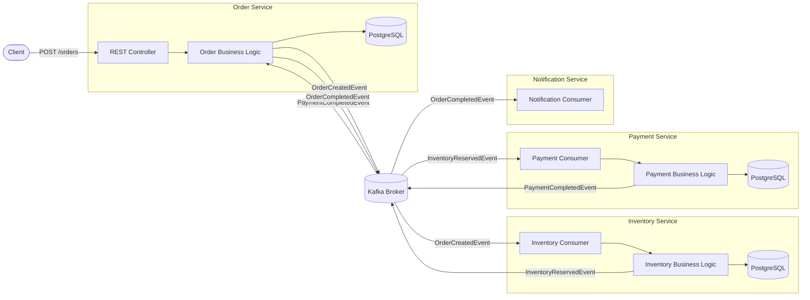

# Rapid Cart - High Level Architecture

```mermaid
flowchart LR

    Client([Client])

    subgraph Order Service
        O1[REST Controller]
        O2[Order Business Logic]
        O3[(PostgreSQL)]
    end

    Kafka[(Kafka Broker)]

    subgraph Inventory Service
        I1[Inventory Consumer]
        I2[Inventory Business Logic]
        I3[(PostgreSQL)]
    end

    subgraph Payment Service
        P1[Payment Consumer]
        P2[Payment Business Logic]
        P3[(PostgreSQL)]
    end

    subgraph Notification Service
        N1[Notification Consumer]
    end

    Client -->|POST /orders| O1
    O1 --> O2
    O2 --> O3
    O2 -->|OrderCreatedEvent| Kafka

    Kafka -->|OrderCreatedEvent| I1
    I1 --> I2
    I2 --> I3
    I2 -->|InventoryReservedEvent| Kafka

    Kafka -->|InventoryReservedEvent| P1
    P1 --> P2
    P2 --> P3
    P2 -->|PaymentCompletedEvent| Kafka

    Kafka -->|PaymentCompletedEvent| O2

    O2 -->|OrderCompletedEvent| Kafka

    Kafka -->|OrderCompletedEvent| N1
```