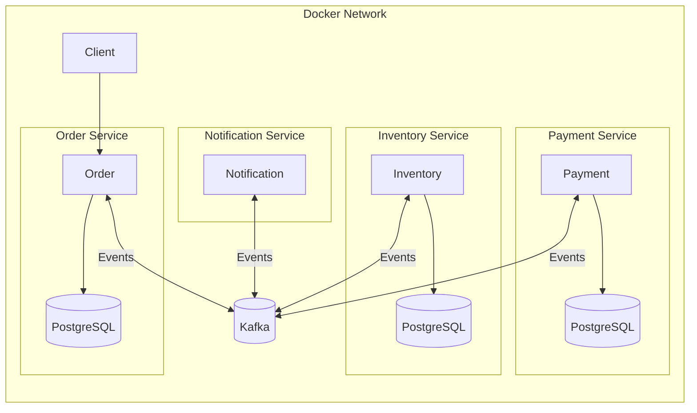

# Deployment Architecture

```mermaid
flowchart LR

subgraph Docker Network

Client

subgraph Order Service
Order
OrderDB[(PostgreSQL)]
end

subgraph Inventory Service
Inventory
InventoryDB[(PostgreSQL)]
end

subgraph Payment Service
Payment
PaymentDB[(PostgreSQL)]
end

subgraph Notification Service
Notification
end

Kafka[(Kafka)]

Client --> Order

Order --> OrderDB

Inventory --> InventoryDB

Payment --> PaymentDB

Order <-->|Events| Kafka

Inventory <-->|Events| Kafka

Payment <-->|Events| Kafka

Notification <-->|Events| Kafka

end
```