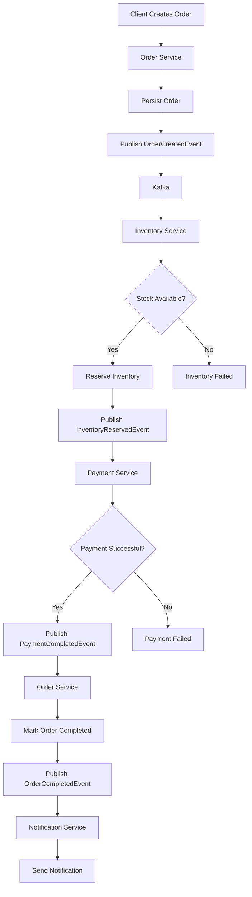

# Event Flow

```mermaid
flowchart TD

A[Client Creates Order]

A --> B[Order Service]

B --> C[Persist Order]

C --> D[Publish OrderCreatedEvent]

D --> E[Kafka]

E --> F[Inventory Service]

F --> G{Stock Available?}

G -- Yes --> H[Reserve Inventory]

H --> I[Publish InventoryReservedEvent]

I --> J[Payment Service]

J --> K{Payment Successful?}

K -- Yes --> L[Publish PaymentCompletedEvent]

L --> M[Order Service]

M --> N[Mark Order Completed]

N --> O[Publish OrderCompletedEvent]

O --> P[Notification Service]

P --> Q[Send Notification]

G -- No --> R[Inventory Failed]

K -- No --> S[Payment Failed]
```