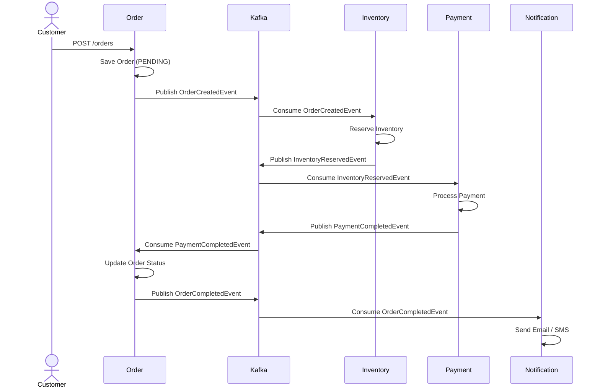

# Order Processing Sequence

```mermaid
sequenceDiagram

actor Customer

participant Order
participant Kafka
participant Inventory
participant Payment
participant Notification

Customer->>Order: POST /orders

Order->>Order: Save Order (PENDING)

Order->>Kafka: Publish OrderCreatedEvent

Kafka->>Inventory: Consume OrderCreatedEvent

Inventory->>Inventory: Reserve Inventory

Inventory->>Kafka: Publish InventoryReservedEvent

Kafka->>Payment: Consume InventoryReservedEvent

Payment->>Payment: Process Payment

Payment->>Kafka: Publish PaymentCompletedEvent

Kafka->>Order: Consume PaymentCompletedEvent

Order->>Order: Update Order Status

Order->>Kafka: Publish OrderCompletedEvent

Kafka->>Notification: Consume OrderCompletedEvent

Notification->>Notification: Send Email / SMS
```